# 🌟 Fashion Hub 🌟

**Fashion Hub** is a sleek brand store application built with Flutter. It offers features like
authentication, a cart system, light and dark themes, and a search functionality for a seamless
shopping experience. With a modern UI inspired by [shadcn_ui](https://pub.dev/packages/shadcn_ui),
the app ensures a user-friendly interface.

[Live Preview](https://thefashionhub.web.app/)

---

## Features

- **Authentication**: Login, Sign-Up, and Reset Password screens with local authentication.
- **Cart System**: Add and delete items using the slidable package.
- **Light and Dark Themes**: Toggle between themes effortlessly.
- **Search Functionality**: Search items by category or name with real-time updates.
- **Hero Animations**: Smooth transitions for a polished UI.
- **State Management**: Managed efficiently with Riverpod.
- **Loading Shimmer Effects**: Enhance the user experience during loading states.

---

## Screenshots

<table>
    <tr>
        <td></td>
        <td>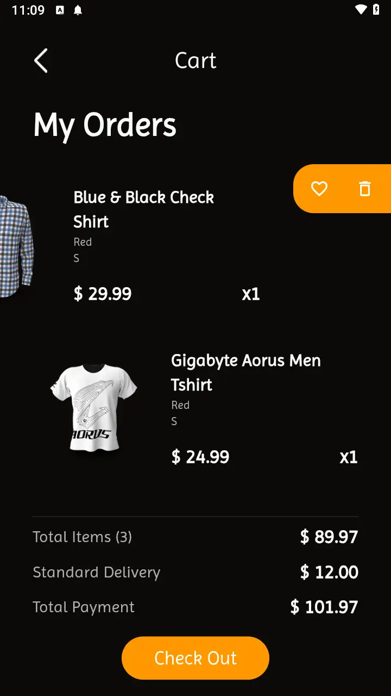</td>
        <td>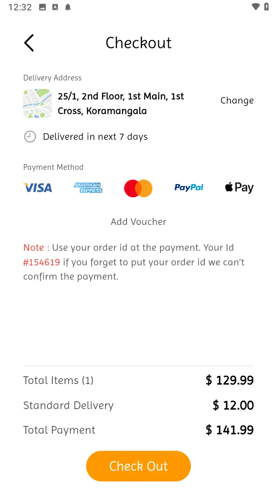</td>
        <td>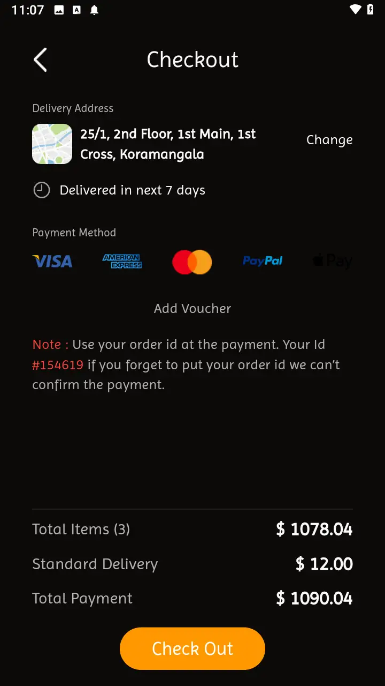</td>
    </tr>
    <tr>
        <td>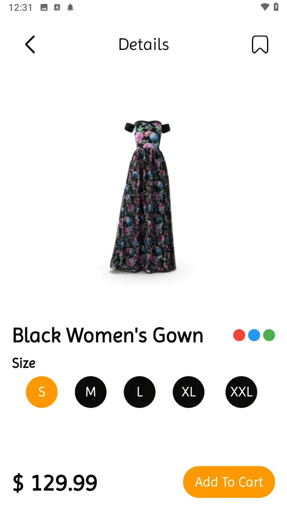</td>
        <td>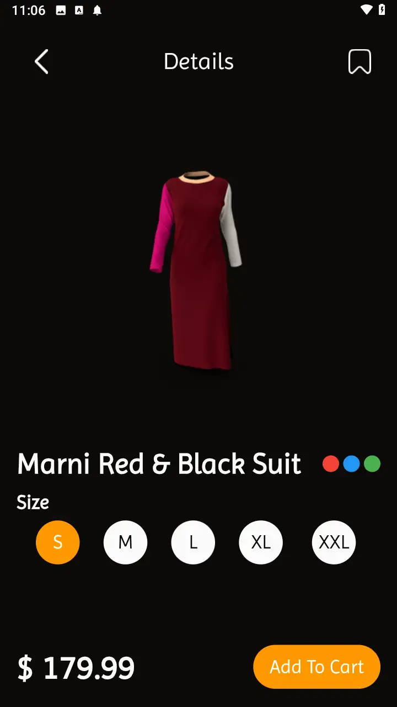</td>
        <td></td>
        <td>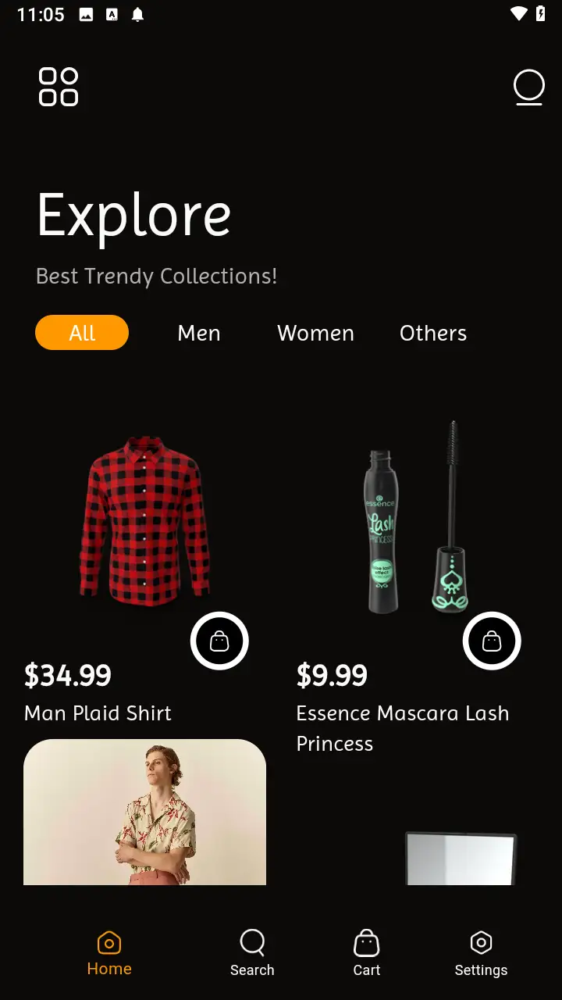</td>
    </tr>
    <tr>
        <td></td>
        <td>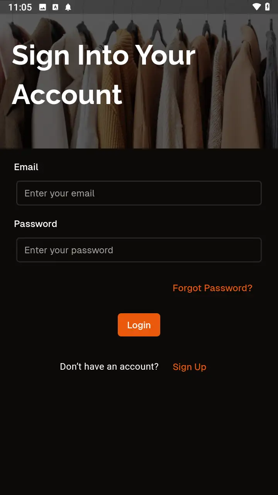</td>
        <td></td>
        <td>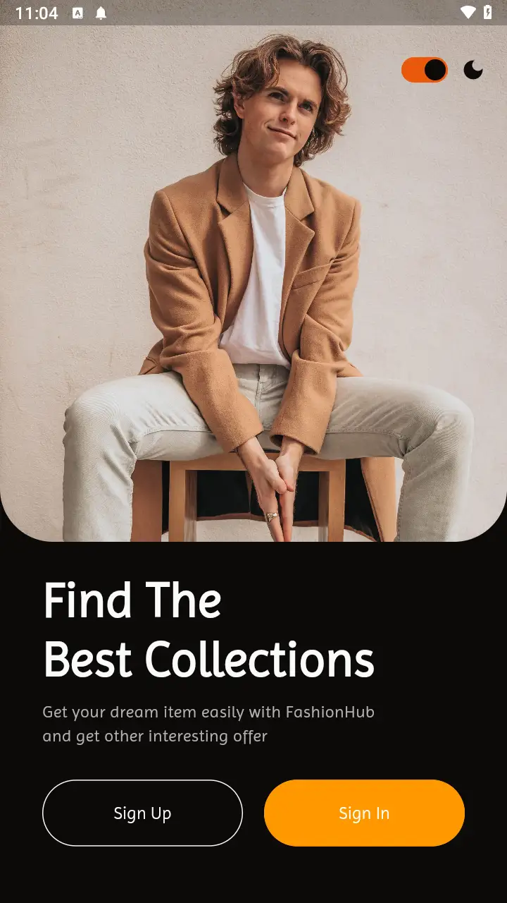</td>
    </tr>
    <tr>
        <td></td>
        <td></td>
        <td></td>
        <td>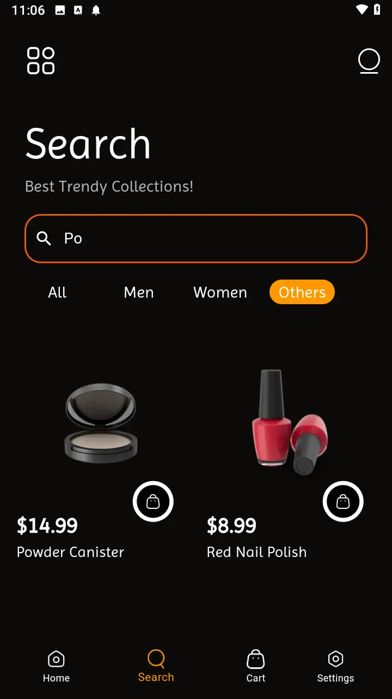</td>
    </tr>
    <tr>
        <td></td>
        <td>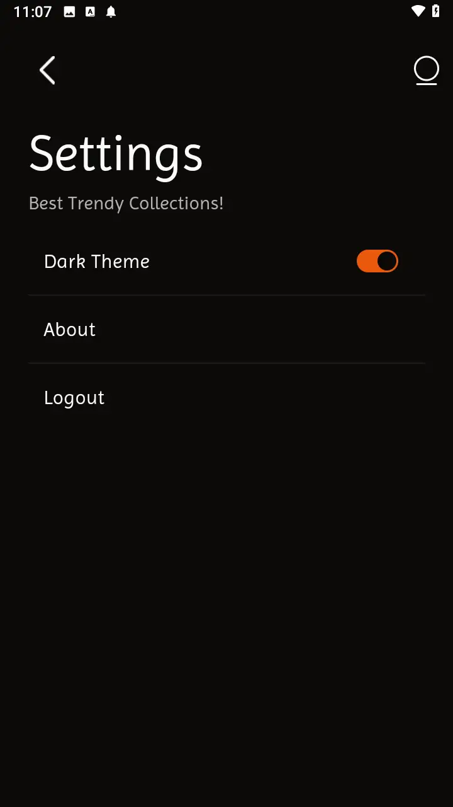</td>
        <td>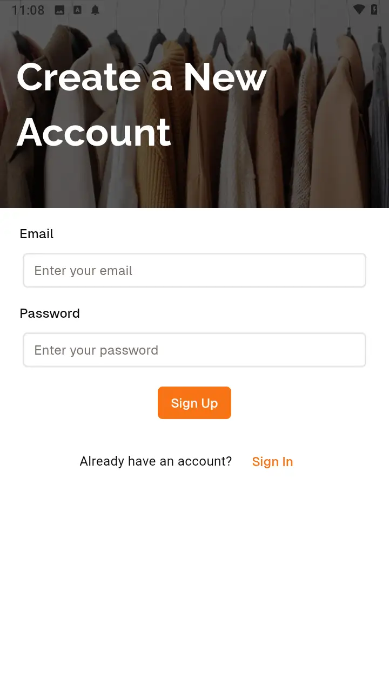</td>
        <td>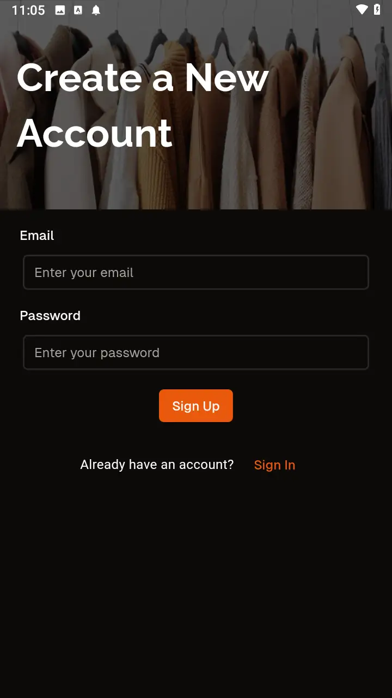</td>
    </tr>
</table>

---

## Screen Recordings

### Authentication Screens

<video autoplay loop muted>
    <source src="assets/screenrecords/Auth%20Screens.mov" type="video/mp4">
    Your browser does not support the video tag.
</video>
Login, Sign Up, Reset Password, and login demonstration.

### Explore Tab (Light Theme)

<video autoplay loop muted>
    <source src="assets/screenrecords/Explore%20Light%20Theme.mov" type="video/mp4">
    Your browser does not support the video tag.
</video>
Browse items and add to the cart.

### Cart and Deletion (Light Theme)

<video autoplay loop muted>
    <source src="assets/screenrecords/Cart%20And%20Deletion%20Light%20Theme.mov" type="video/mp4">
    Your browser does not support the video tag.
</video>
View and delete items in the cart.

### Search Functionality (Light Theme)

<video autoplay loop muted>
    <source src="assets/screenrecords/Search%20Light%20Theme.mov" type="video/mp4">
    Your browser does not support the video tag.
</video>
Walkthrough of search functionality, including category-based search.

### Checkout Process

<video autoplay loop muted>
    <source src="assets/screenrecords/Checkout.mov" type="video/mp4">
    Your browser does not support the video tag.
</video>
Demonstrates the checkout flow.

### Light and Dark Themes

<video autoplay loop muted>
    <source src="assets/screenrecords/Light%20And%20Dark%20Theme.mov" type="video/mp4">
    Your browser does not support the video tag.
</video>
Switching between light and dark modes.
